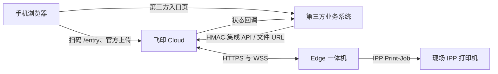
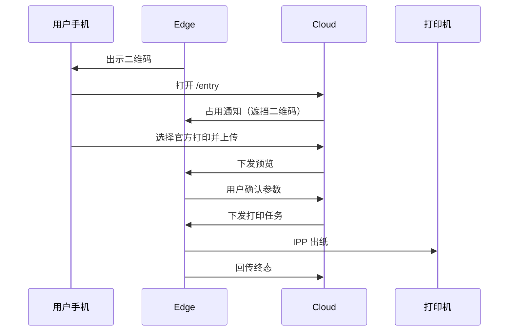
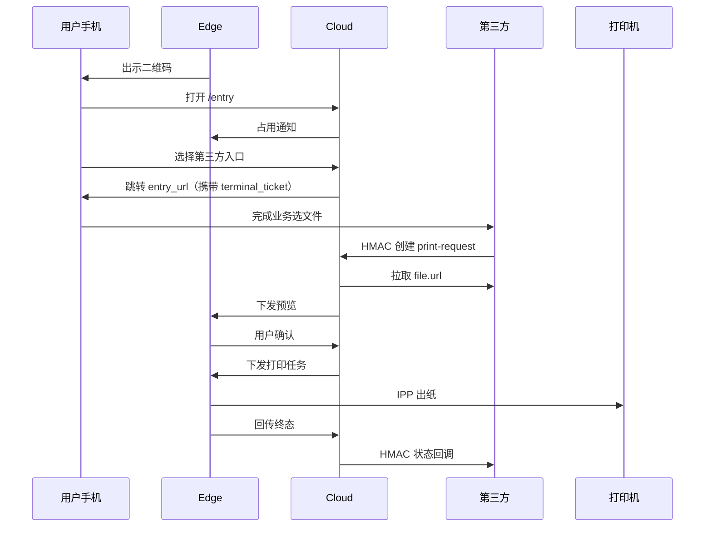

# 飞印（FlyPrint）系统说明

| 属性 | 说明 |
|------|------|
| 文档类型 | 产品与体系结构说明 |
| 适用产品 | 飞印云打印平台（Cloud 控制面 + Edge 一体机终端） |
| 相关文档 | [部署与验证](部署与验证.md) · [第三方接入指南](第三方接入指南.md) |
| 修订说明 | 描述产品行为与安全边界；不替代接口契约与运维手册 |

---

## 1. 概述

飞印是面向自助与现场场景的**通用云打印平台**。系统由云端控制面（Cloud）与一体机终端（Edge）组成：Cloud 负责任务编排、文件与凭证、节点及打印机登记；Edge 负责出示二维码、用户预览确认，并经 **IPP** 将文档提交至现场打印机。

**Cloud 不直接连接现场打印机。** 所有出纸均由 Edge 经 IPP 完成。用户须在一体机上预览并确认后，系统才会创建正式打印任务。第三方业务系统仅通过 Cloud 集成接口下单，不得直连 Edge 或打印机。

### 1.1 组件角色

| 组件 | 职责 |
|------|------|
| Cloud | 认证与管理端、边缘节点与打印机登记、文件与访问凭证、打印任务编排、经 WebSocket 向 Edge 下发预览与打印指令 |
| Edge | 终端出码、全屏用户界面、参数预览与确认、文档规范化、IPP 提交与作业终态回传 |
| 现场打印机 | 接收 IPP 作业并完成出纸；与一体机网络可达 |

### 1.2 技术概要

| 层级 | 技术选型（摘要） |
|------|------------------|
| Cloud | Go（Gin）、PostgreSQL、WebSocket；管理端为 React |
| Edge | Python 运行时、本地用户/管理界面；用户页由 Microsoft Edge 全屏 kiosk 启动 |
| 部署 | 推荐 Docker Compose 部署 Cloud；Edge 以 Windows 安装包交付 |

Compose 默认统一入口端口为 **8012**（可通过环境变量调整）。

### 1.3 逻辑架构

Cloud 不直连现场打印机；出纸仅发生在 Edge → 打印机链路。

### 1.4 产品边界

下列约束为产品设计的一部分，部署与对接时须遵守：

- Cloud 不直连现场打印机；打印链路仅为「文档 → 标准 PDF → IPP Print-Job → 设备完成」。
- 用户必须在 Edge 上确认后，才会创建正式打印任务。
- 第三方不得跳过 Edge 确认，不得直连打印机。
- Edge 不提供 Spooler / WSD / RAW 等替代打印回退。
- 作业结果为「未确认」（`unconfirmed`）时，系统禁止静默自动重打。

---

## 2. 端到端业务流程

### 2.1 官方打印

终端票据在入口签发后具有有限有效期（约 5 分钟，且不超过上传凭证剩余时间）。进门后 Edge 遮挡二维码，表示本机已被占用。

### 2.2 第三方打印

字段、签名与状态机以 [第三方接入指南](第三方接入指南.md) 为准；本文不重复接口细节。

### 2.3 网络地址约定

部署时须区分三类可达性，避免混用：

| 链路 | 配置要点 | 常见错误 |
|------|----------|----------|
| 手机 / 浏览器 → Cloud | 用户可达的 Cloud 根地址（公网一般为 `https://域名`） | 对手机使用 `localhost` |
| Edge → Cloud | 与上一致，配置于 Edge 的 `cloud.base_url` | 配置为仅一体机本机可达的地址 |
| Cloud → 第三方回调 | Cloud **出站**可达的回调基址 | 将手机访问地址误用作容器内回调地址 |

同机 Compose 联调第三方 Demo 时，Cloud 到 Demo 的回调常使用容器服务名（例如 `http://integration-demo:8080`），与手机访问的入口地址不同。

---

## 3. 功能说明

### 3.1 Cloud 管理端

| 模块 | 能力 |
|------|------|
| 仪表盘 | 告警与任务汇总 |
| 边缘节点 | 激活、在线状态、别名、启停；「关联」列展示运维联系人/打印机/任务数量并可跳转筛选 |
| 运维人员 | 展示用联系人档案（姓名+电话；非登录账号）；与节点多对多绑定 |
| 打印机 | 显示名、启停、所属节点；任务数量跳转；任务列表在无显示名时回退设备本名 |
| 打印任务 | 状态、发起方与错误信息查询；节点/打印机/来源可互跳（一跳一为上 ID + 下名称） |
| 业务配置 | 上传大小与页数、凭证有效期、扩展名白名单、每节点联系人上限等 |
| 第三方接入 | 接入方配置（`code` 唯一）、密钥创建与轮换、启停；任务计数跳转筛选 |

公开上传页用于官方扫码流程中的手机上传，**无需**管理端登录。

### 3.2 Edge 用户界面（kiosk）

| 能力 | 说明 |
|------|------|
| 扫码待机 | 展示二维码；倒计时刷新；故障或占用时遮挡二维码；页脚展示节点运维联系人姓名+电话（无人则回退旧文案） |
| 一机占用 | 用户进门后遮挡二维码；支持刷新以作废旧会话并重新出码 |
| 预览确认 | 份数、双面、色彩等参数；确认后提交打印 |
| 打印中 | 不可中断返回扫码页 |
| 完成提示 | 成功、失败及缺纸、缺粉等设备类提示 |

用户界面由启动器以 Microsoft Edge 全屏 kiosk 方式打开。

### 3.3 Edge 本机管理

本机管理用于配置 `cloud.base_url`、节点激活、IPP 打印机发现与默认打印机、日志查看等。默认仅监听本机回环地址（`127.0.0.1:7860`），依赖物理可达性进行运维；**不提供独立的「本机管理员密码」**。若将管理面改为非回环暴露，须另行规划访问控制。

### 3.4 打印任务与状态

| 概念 | 说明 |
|------|------|
| 打印机寻址 | 以 Cloud 侧打印机标识为准；显示名仅用于展示 |
| 收件确认 | Edge 确认收到任务并落盘，不等于设备已打印完成 |
| 终态 | 包括完成、失败、取消、未确认等；状态更新带稳定事件标识，支持幂等处理 |
| 未确认 | 结果不明（例如终端重启）；禁止静默重打，须按运维规程处理 |

---

## 4. 会话、票据与占用

| 对象 | 作用 |
|------|------|
| 上传凭证 | 扫码进入入口页；校验成功后换发独立终端票据 |
| 终端票据（`terminal_ticket`） | 将本次业务绑定到指定终端与打印机；第三方仅持有该票据 |
| 会话与票据摘要 | 预览、上传与占用须与当前终端会话一致；刷新二维码将作废未完成票据 |
| 占用通知 | Cloud 通知 Edge 遮挡二维码；Edge 确认接收；重连时按需补发，已绑定同一票据时不重复轰炸 |
| 入口重选 | 尚未上传或尚未向第三方提交前，允许返回重选入口；之后不可更换 |

---

## 5. 传输与安全约定

- Cloud 对外地址、Edge 的 `cloud.base_url`、以及第三方入口 / 回调 / 文件地址均支持 **HTTP 与 HTTPS**（禁止在 URL 中嵌入用户名密码）。
- 出站访问（拉取文件、回调等）使用系统默认信任链；**不支持将自签证书作为默认可信出站信任**。公网正式环境请使用受信证书。
- Edge 与 Cloud 之间：REST 跟随 `cloud.base_url` 的协议；WebSocket 自动映射为 **ws** 或 **wss**。
- 若 `cloud.base_url` 配置为 `localhost` / `127.0.0.1`，出码时可能被改写为局域网 IP，**HTTPS 场景下易导致证书主机名失败**。公网部署应直接配置证书对应域名。

---

## 6. 范围说明

第 1.4 节所列边界之外，下列能力当前不作为本产品对外交付范围，或须另行规划：

| 项 | 说明 |
|------|------|
| 自签证书出站信任 | 不支持 |
| 多租户计费、完整用户中心等 | 视版本规划另行交付 |

接口级对接请参阅 [第三方接入指南](第三方接入指南.md)。现场安装与验收请参阅 [部署与验证](部署与验证.md)。打印机侧连通性与耗材问题见该文档「常见问题」。

---

## 7. 相关文档

| 文档 | 内容 |
|------|------|
| [部署与验证](部署与验证.md) | 安装、配置、验证与排障 |
| [第三方接入指南](第三方接入指南.md) | 第三方对接契约与联调说明 |
| 仓库 README | 源码结构与开发环境说明 |
